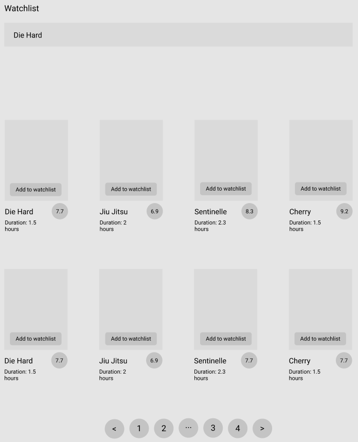

# Akrod Movie Database App

Find your next movie or create your watchlist with this App.

-   This application will help users find their next movie to watch by showing helpful information
-   Resource needed for the project is movie api, examples include Imdb, MovieDB etc.

## Install

In order to use the required version of node for the project, make sure you have NVM installed and then do:

```zsh
nvm use
```

### App

To install all necessary app packages do the following inside `/app`

```zsh
npm install
```

And to run in your local do

```zsh
npm start
```

### Services

To install all necessary services packages do the following inside `/services`

```zsh
npm install
```

And to run in your local do

```zsh
npm run dev
```

### Insfrastruture

To deploy the services in your AWS account, you will need to have Terraform installed in your computer and AWS CLI configured with the correct credentials.

Before running `terrraform plan` or `terraform apply` make sure you remove all unecessary files from `/services/` and run `npm intall --production`. This is required to unsure Terraform only zips the necessary files into the bundle to be sent into the lambda.

After a successful apply the API url will be output in your console.

## User Stories

-   [ ] User can see a paginated list of popular movies ordered by release date (from latest to oldest). Movie details can be only **title**, **duration**, **rating** and **release date** (only for ordering purposes).
    - See sample prototype:
    

-   [ ] User can add any movie to the default watchlist

## Bonus features

-   [ ] User can search a movie by its title :fire: or user can type in an autocomplete any word of a movie (e.g. "Die Hard", "Live and let Die") :fire::fire::fire:
-   [ ] User can create different watchlists (with different titles)

## Technical requirements
- There should be both frontend (React or React Native) and backend code (preferably NodeJS, C# or Python)
- Feel free to use an in-memory database to store the watchlist

## Technical bonus
- Use of structured state management libs in the frontend (like Redux, Zustand, XState etc.)
- If can use any AWS service (like AWS Lambda, DynamoDB, Aurora etc), it would be awesome
- If you manage to write tests
- If you manage to automate the creation of AWS resources (with tools like terraform, CDK, serverless framework, etc.), then you are a **HERO**

## How to proceed
- For those applying for a React Native position, the frontend should be built using React Native. By the same token, for those applying for a ReactJS position, the frontend should be built using react.
- Just fork this repo and send us a pull request :wink:

## Useful links and resources

-   [MovieDB Api](https://developers.themoviedb.org/3)

## Example projects

[Movie Browser App by Nataliia Pylypenko](https://api-cinema-10d15.firebaseapp.com/)
